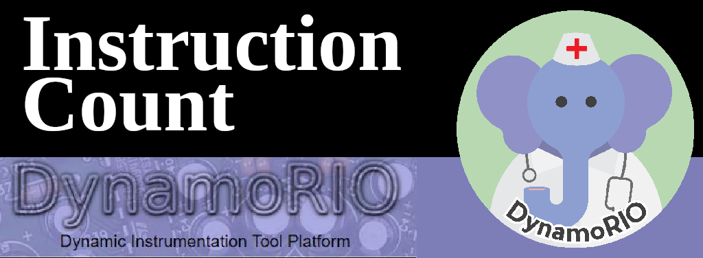

# Dynamo Tool
## Instruction Count 
Simple instrumentation for instruction counting made on c++ to be used with [dynamorio](https://dynamorio.org/).

## Disclaimer

These instructions tools have a hashmap folder, it is a c library made with [Andrei Rimsa](http://rimsa.com.br/page/) `mostly him` :rofl: . Andrei is my professor and thesis tutor from CEFET-MG.

## How to Install

### Install Dynamorio.

```bash
git clone https://github.com/DynamoRIO/dynamorio.git
cd dynamorio
```

### This tool package

```bash
# go into the correct folder
cd api/samples
# clone to the here
git clone https://github.com/afa7789/dynamorio_instruction_count.git dynamo_tool
# extract it
cp ./{dyn.patch,bbl_count.cpp} .
# Add line to CMakeLists
patch < dyn.patch
```
## Running the tool

### Make first

#### Make Dynamorio

```bash
cd dynamorio
DYNAMORIO_HOME=$(pwd);
mkdir build && cd build
cmake  -DBUILD_DOCS=no ..
make -j
```

#### make tool

```bash
cd build
make bbl_count
```
### Running it
Commands to run this code
#### bbl_count.c

```bash
$DYNAMORIO_HOME/bin64/drrun -c bin/libbbl_count.so -- ls 
# how to use to get the output to a file.
$DYNAMORIO_HOME/bin64/drrun -c bin/libbbl_count.so arquivo_test.txt -- ls 
# Example with full path
$DYNAMORIO_HOME/build/bin64/drrun -c /home/afa/Documents/code/TCC/dynamorio/dynamorio/build/api/samples/../bin/libbbl_count.so -- ls 
```
